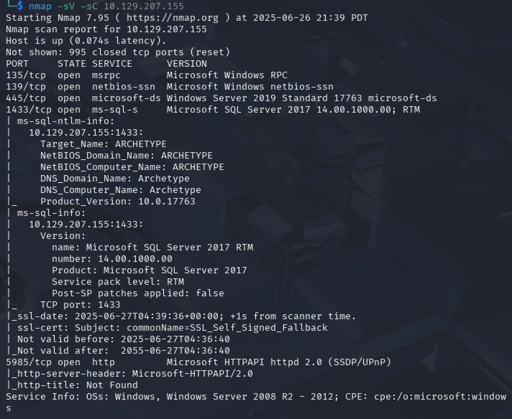
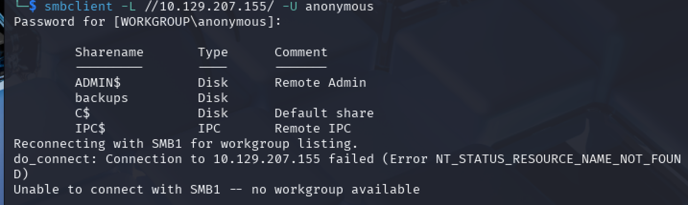
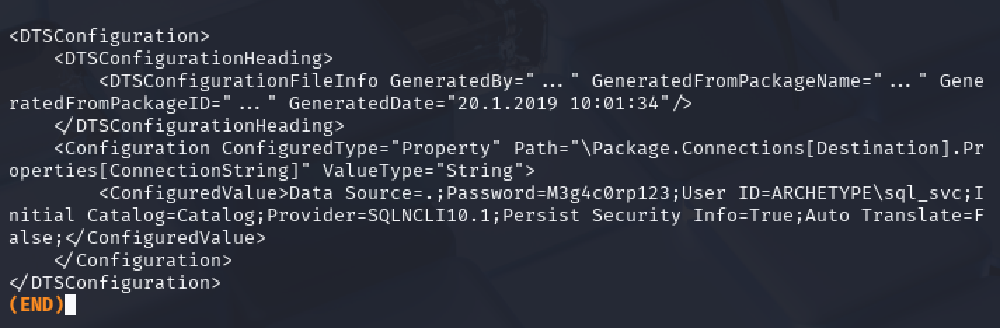
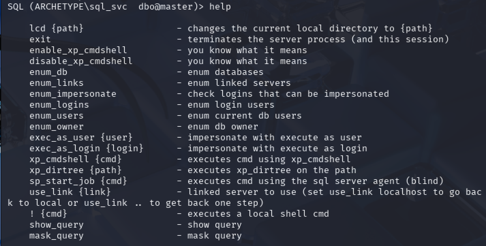
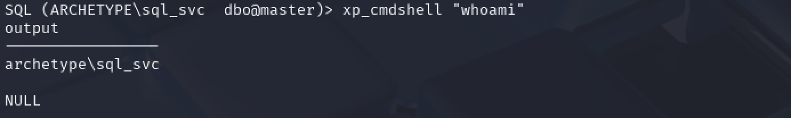
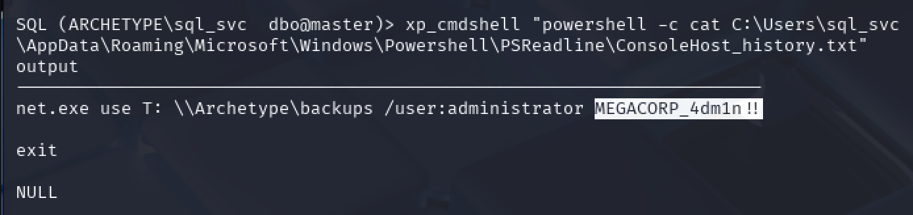

# Archetype

## User Flag
When starting a box it's always a good idea to run nmap to enumerate services on the target machine. Running `nmap -sV -sC 10.129.207.155` shows us the versions of services running and may point us towards vulnerabilities. The scripts don’t give us much, but we see that the machine has five TCP ports running:

We have several interesting ports to look at. Port **445** is generally used for SMB, port **1433** is hosting a SQL Server database, and port 5985 is hosting an http service. We can assume port 5985 is used for WinRM, since port 5985 is known to host WinRM and WinRM uses http.

We will first check if we can connect to the SMB share. We try with the anonymous user using the command `smbclient //10.129.207.155/ -U anonymous`:

We fail to connect but we do see several shares. We see that the only non-administrative share is backups.

We can connect to the backupshare via the command `smbclient -N //10.129.207.155/backups// -U anonymous`.

Running the `ls` command, we can see that the only item in the share is **prod.dtsConfig**. Running `more prod.dtsConfig` shows us that the password for the user **ARCHETYPE\sql_svc**  is **M3g4c0rp123**.

With these credentials, we can try connecting to the sql server instance. Kali Linux offers many different ways to connect to a SQL Server instance, but we will use the **impacket** modules to do so. We can run `impacket-mssqlclient ARCHETYPE/sql_svc:M3g4c0rp123@10.129.207.155 -windows-auth -port 1433`, which successfully connects us.

Running help shows us a list of commands we can run.

In particular, any commands allowing us to run command line commands will be useful. The `! {cmd}` method will run commands on our local (attacker) machine so the other option seems to be `xp_cmdshell`.

We can try a simple `xp_cmdshell “whoami”`. We immediately see that we are blocked from running this.

The help menu indicated that we can enable it using `enable_xp_cmdshell`. After a `RECONFIGURE`, we can run the command, which seems to work:

To run more complicated windows commands we can try using powershell to get more information on the system: `xp_cmdshell “powershell -c { command_to_run }“`.  We run `xp_cmdshell "powershell -c pwd"` to find that we are in **C:/Windows/system32**. It is usually helpful to look at the users for the computer so we can try `xp_cmdshell "powershell -c ls C:/Users"`. **C:/Users/sql_svc** seems very promising and, sure enough, we can find **C:\Users\sql_svc\Desktop\user.txt** to get the user flag. We obtain this by running `xp_cmdshell “powershell -c cat C:\Users\sql_svc\Desktop\user.txt”` to get the user flag.

## Root Flag
We can’t seem to access the contents of the Admin folder (likely where the root flag is) so we need to look elsewhere on the system for the admin credentials.

A good place to check would be the powershell logs. By convention, this is located at **C:\Users\sql_svc\AppData\Roaming\Microsoft\Windows\Powershell\PSReadline\**. At this directory we see that there is a file named **ConsoleHost_history.txt**. This may contain useful information, so we run `xp_cmdshell "powershell -c cat C:\Users\sql_svc\AppData\Roaming\Microsoft\Windows\Powershell\PSReadline\ConsoleHost_history.txt"`.

This gives us the administrator password as **MEGACORP_4dm1n!!**]

Now we can use these credentials to connect via impacket-psexec since we have our windows username and password for the system. We run `impacket-psexec administrator@10.129.207.155`. We can easily navigate to **C:\Users\Administrator\Desktop\root.txt to get the flag**.

