# Base
## User Flag
When starting a box, it's always a good idea to run nmap to enumerate services on the target. Running `nmap -sV -sC 10.129.95.184`
shows us the service versions and might point us toward known vulnerabilities.

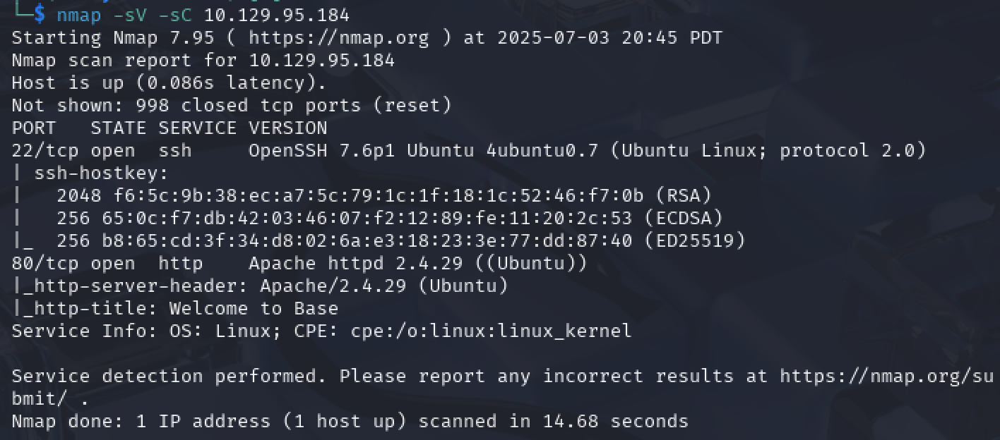

Port 22 is running ssh, port 80 is running http.

Let’s open BurpSuite and set `http://10.129.95.184/` as the target.  We are taken to this login page: 

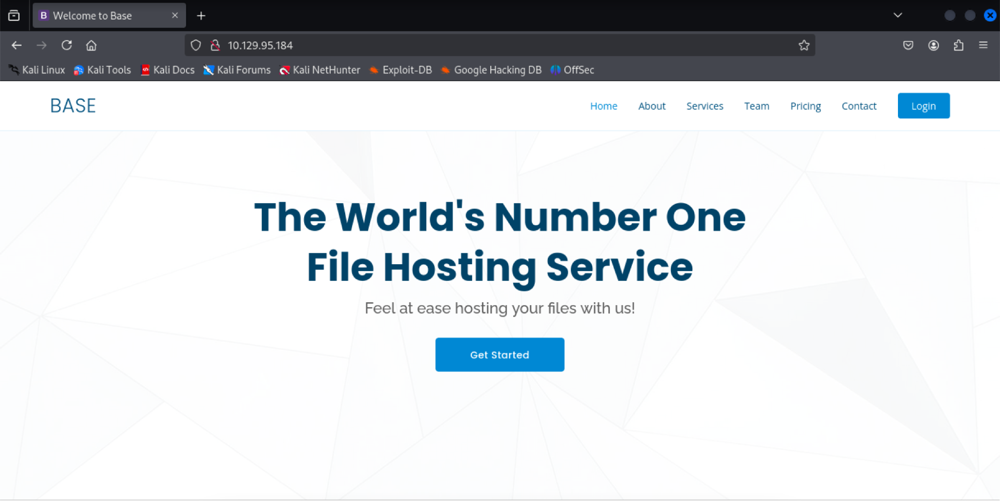

We can click on the Login button to take us to this page:


The path to the login page is `http://10.129.95.184/login/login.php`. We can also try going to `http://10.129.95.184/login` to see all of the files in the login folder. We see three: 

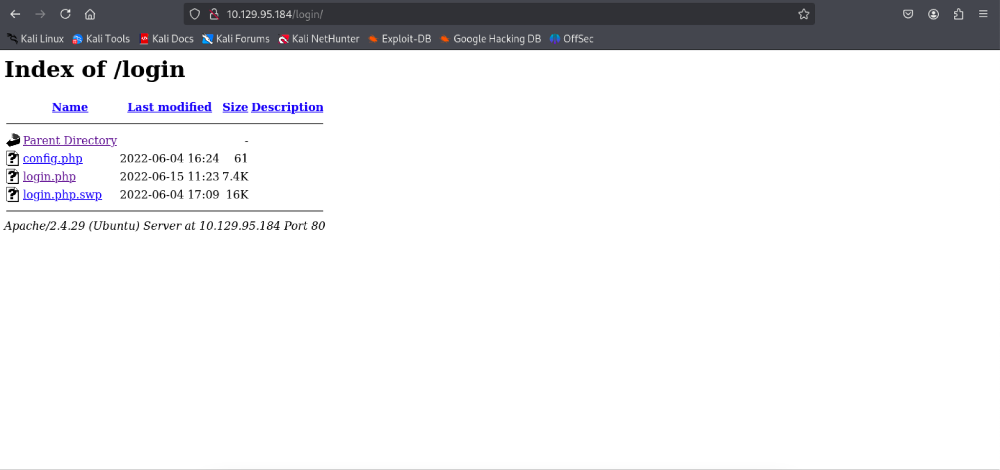

Notice the `login.php.swp` file. Maybe there is some information that could help us in that. If we download the file and run `more login.php.swp`, we can scroll down to find that the password and username are being checked using the `strcmp()` function. 

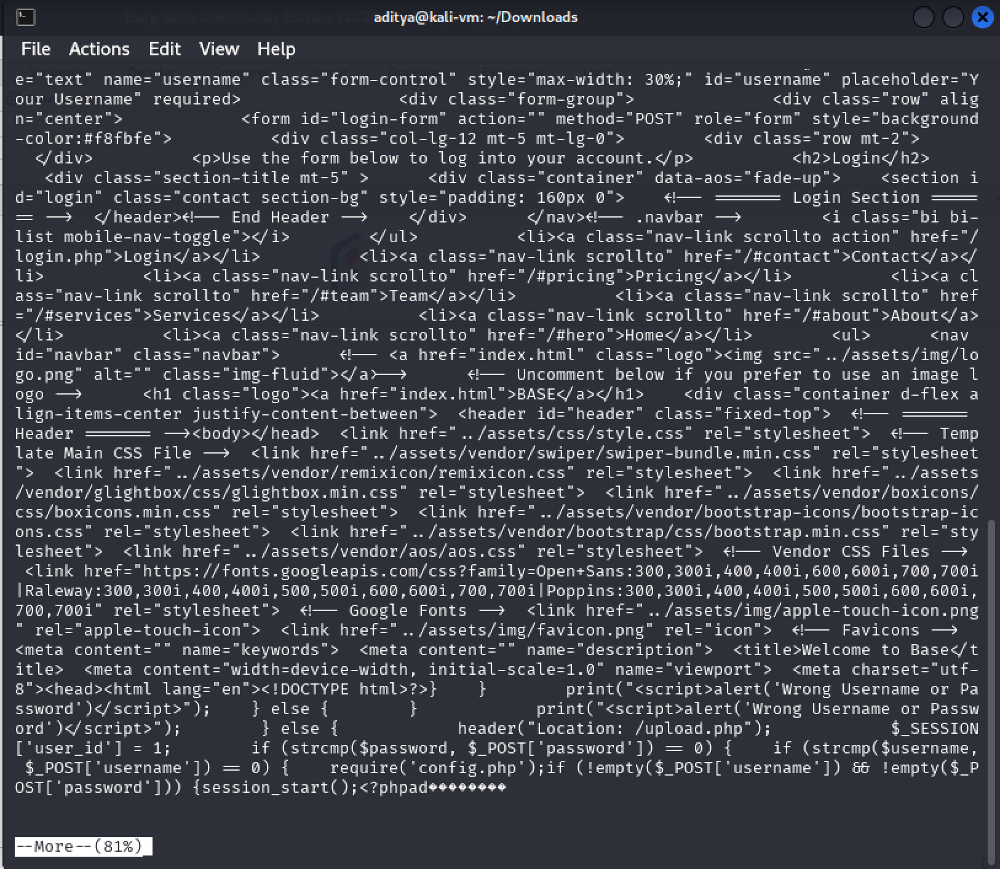

`strcmp()` is known to be unsafe, so maybe there is a way to use that knowledge to bypass logging in. 

This function is known to be unsafe because it only works on strings that have been successfully null terminated. We can figure out how to bypass the login using this [page here](https://rst.hashnode.dev/bypassing-php-strcmp). We can intercept a login with BurpSuite and then modify the post request as follows: 

```
POST /login/login.php HTTP/1.1
Host: 10.129.95.184
Content-Length: 31
Cache-Control: max-age=0
Accept-Language: en-US,en;q=0.9
Origin: http://10.129.95.184
Content-Type: application/x-www-form-urlencoded
Upgrade-Insecure-Requests: 1
User-Agent: Mozilla/5.0 (X11; Linux x86_64) AppleWebKit/537.36 (KHTML, like Gecko) Chrome/133.0.0.0 Safari/537.36
Accept: text/html,application/xhtml+xml,application/xml;q=0.9,image/avif,image/webp,image/apng,*/*;q=0.8,application/signed-exchange;v=b3;q=0.7
Referer: http://10.129.95.184/login/login.php
Accept-Encoding: gzip, deflate, br
Cookie: PHPSESSID=p2n8q45ggpk9uuqfumnmhv3is6
Connection: keep-alive

username[]=test&password[]=test
```
We can send this to the server and it takes us to this page: 

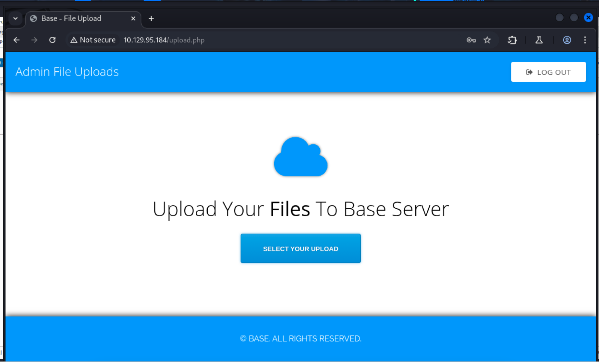

We can upload files here but we’re not really sure where they are stored. To find this out, we can try using gobuster to get a filetree for the web service. For example: 

`gobuster dir -u 10.129.95.184 -w /usr/share/wordlists/dirbuster/directory-list-1.0.txt`

It turns out they are stored in the `/_uploaded` folder: 

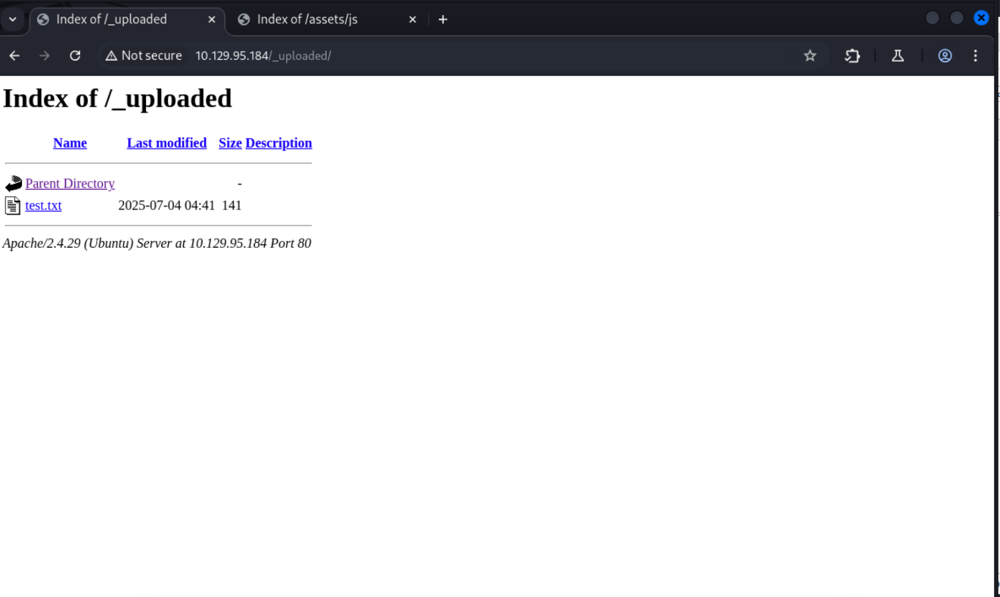

We can try setting up a php reverse shell. Let’s upload the `php-reverse-shell.php` file from `/usr/share/webshells/php/php-reverse-shell.php`, changing the IP address to our `tun0` ip address and the port to port `4444` (could be whatever port you want). 

Then we visit `http://10.129.95.184/_uploaded/php-reverse-shell.php` to trigger the reverse shell, giving us access. Once in, we can run `script /dev/null -c bash` to upgrade the shell: 

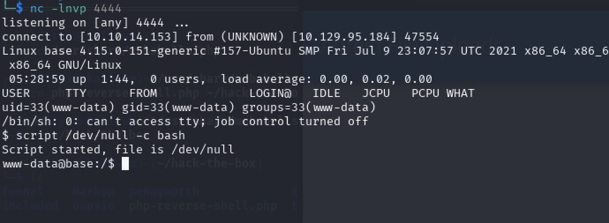

Navigating to the `/home` directory, we see there is a user named `john`

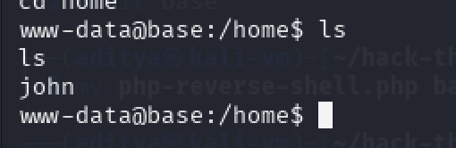

However, we have no information on a password for `john`. We can try navigating to `/var/www/html` to see if there is anything there for us. Checking the `config.php` file, we actually find the administrator password:

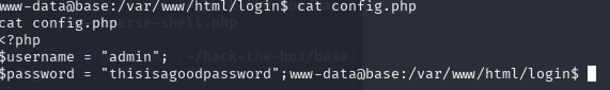

So now we know how to log into the website properly without the `strcmp()` exploit from earlier. If we use this password to login as `john` (just run `su john` and then input the password), we are successful. Now we can go back to `/home/john/user.txt` to get our user flag. 

## Root Flag
To see what commands we can run as john, we run `sudo -l`, to show us this:

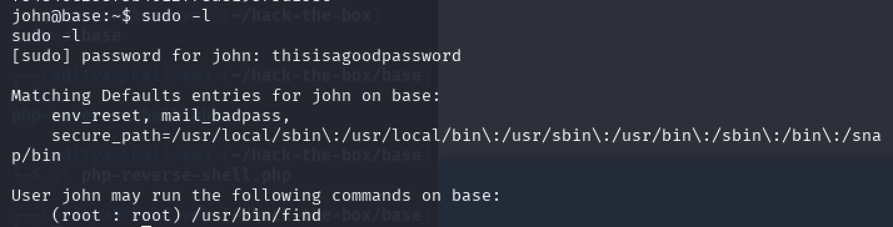

A quick look at the manual for find (run `man find`) shows us that we can execute commands using the `-exec` flag: 

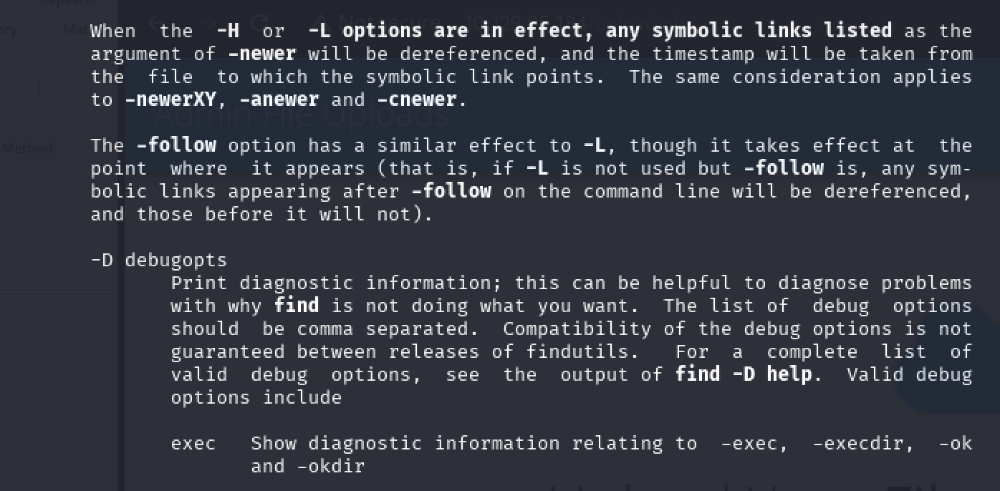

We know we can find the root flag in the `/root` folder with the name `root.txt`. Thus, if we use the following command: `sudo find /root -name '*.txt' -exec cat {} ';'`

We should be able to get the root flag, which we do. 