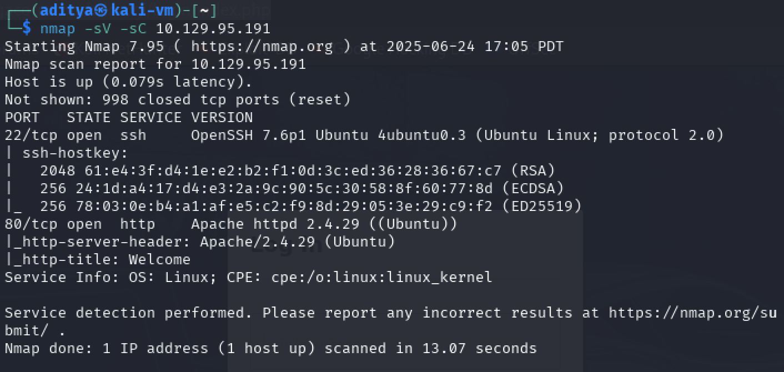
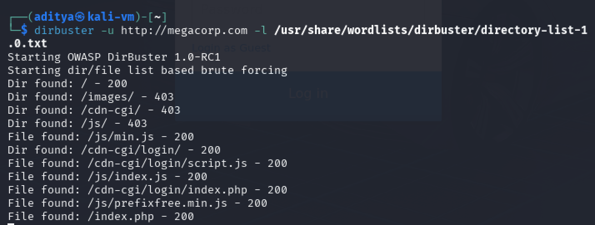
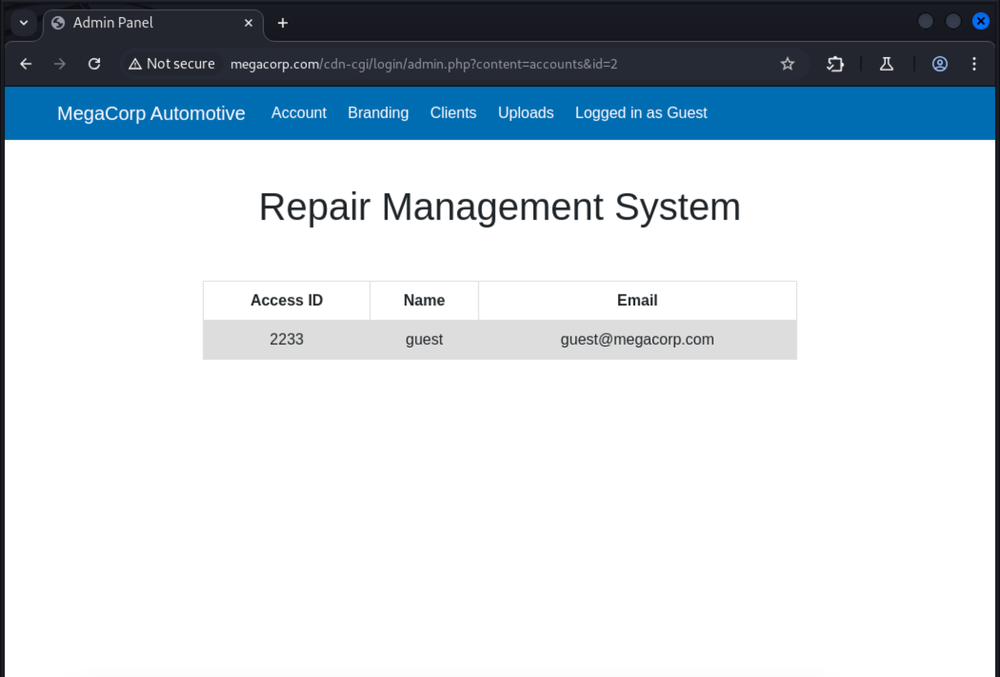
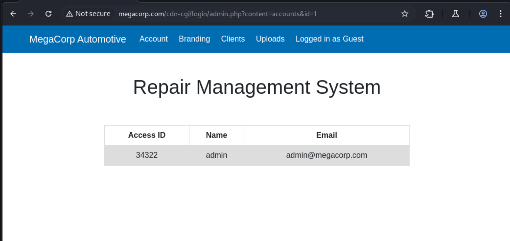
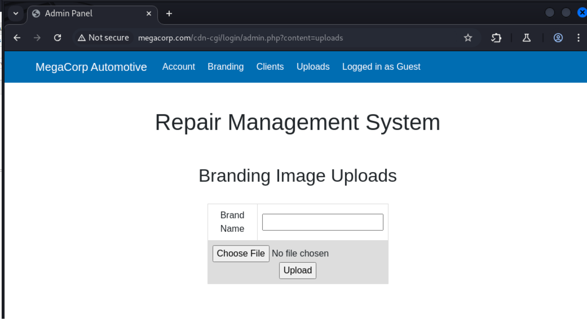
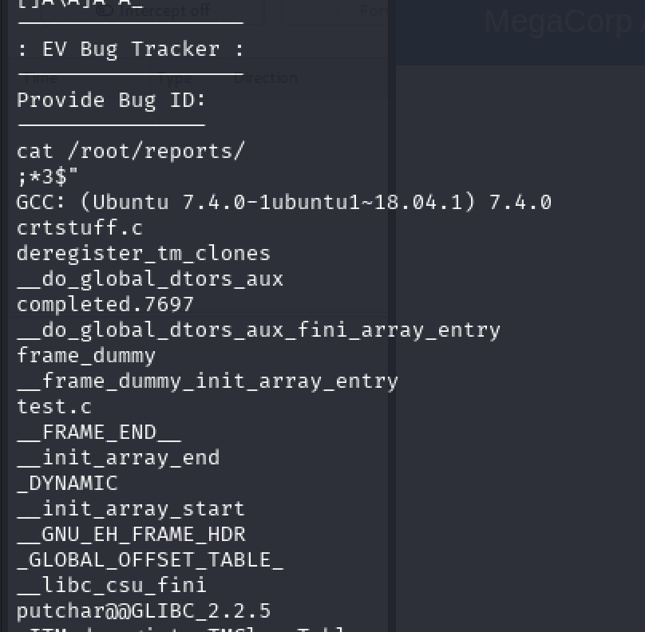

# Oopsie
## User Flag

When starting a box it's always a good idea to run nmap to enumerate services on the target machine. Running `nmap -sV -sC 10.129.95.191` shows us the versions of services running and may point us towards vulnerabilities. The scripts don’t give us much, but we see that the machine has two TCP ports running:

Given that the only services we have to look at are **ssh** and **http**, http is the best one to start out with.

Using the IP address, we can navigate to the web page. There isn’t much to go off of here, but we can see that there is an email address at the bottom of the page with the domain megacorp.com. If we run `sudo vi /etc/hosts` we can add the domain name resolution for the IP address **10.129.95.191** to **megacorp.com**. Once this is done, we can see if there are any other pages related to this domain using the `dirbuster command dirbuster -u http://megacorp.com -l /usr/share/wordlists/dirbuster/directory-list-1.0.txt`:

The **/cdn-cgi/login/index.php** page looks like a good place to start. We navigate to **http://megacorp.com/cdn-cgi/login.index.php**.
There is a place for a username and password, but it also lets us log in as guest. Just in case there’s any interesting information, we fire up BurpSuite to inspect traffic.
We can log in as guest from here. When you click on Account you see this:

On burpsuite you see this:

Notice how the Access ID **2233** and the Name **guest** are parts of the cookie. If we can find other accounts, we can potentially find the cookie for the admin user. If we go to the URL and change the **id** to 1, we see this:

Which gives us a new value to put in for our cookie. When we click Uploads, we see that we need superadmin rights. We can enter our cookie as **user=34322; role=admin** in BurpSuite. Then it will take us to the upload page, which means even a regular admin can open the page.

We need to upload a reverse shell (PHP). So we go to **/usr/share/webshells/php/php-rever-shell.php** on our Kali Linux machine. We modify the IP address and the port to use our tun0 IP and a port of our choosing (we went with 4444). We can upload this to the server using the web interface. On our Kali Linux machine, we can start a `nc -lvnp 4444`. We saw earlier that there is an uploads folder for the IP address of the box, which is probably where the uploads go. So we can run `curl 10.129.95.191/uploads/php-reverse-shell.php`. This will open a shell.

Now that we have a shell, let’s investigate the **/home** folder. Going to **/home/robert** shows us **user.txt**, which is the user flag.

## Root Flag

Now we need the admin flag. We can check **/var/www/html** folder (which is a known apache folder). And find **/var/www/html/cdn-cgi/login**. In this directory we see another file called **db.php**. Looking into it shows us robert’s username and password:

We can ssh with these credentials.

Once in, there doesn’t seem to be much to go off of.

To get a root shell for the root flag, we will try to find a script that has the `suid` permission. If a program can be run with the root permissions, then we can use it to escalate privileges. We can find which ones have the suid bit set by running the command `find / -perm -u=s -type f 2>/dev/null`.

A list of programs come up but **/usr/bin/bugtracker** looks the most interesting because it isn’t a default program.

Inspecting the contents of the file (using strings `/usr/bin/bugtracker`) we see the command `cat` doesn’t have an absolute path associated with it in the script:

We can create our own cat executable in **/tmp/cat** with the content **/bin/sh**. We will also add it to the PATH variable (`export PATH=/tmp;$PATH`) so when bugtracker tries to run `cat /root/report/`, it will open up a root shell instead. Now when we run bugtracker, a root shell starts. We can go to **/root/root.txt** for the flag.
