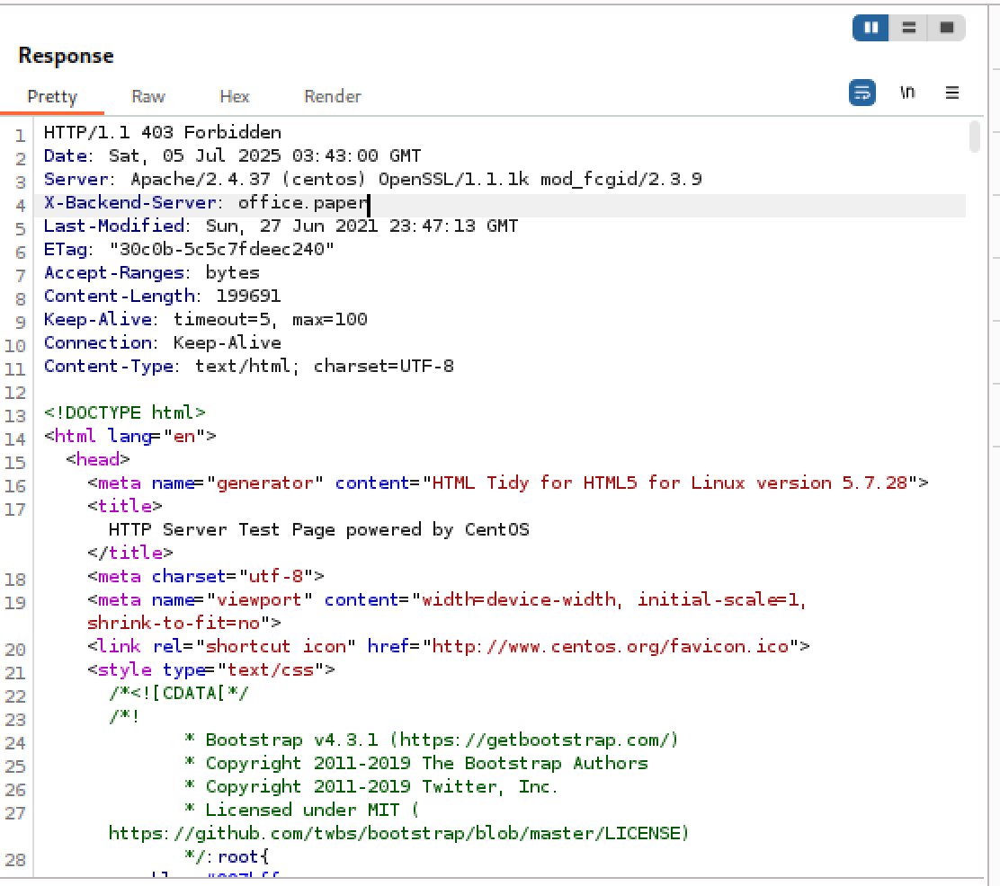

# Base
## User Flag
When starting a box, it's always a good idea to run nmap to enumerate services on the target. Running `nmap -sV -sC 10.10.11.143` shows us the service versions and might point us toward known vulnerabilities.

Looks like ports 22 (ssh), 80 (http), 443 (https) are open. Let’s start by investigating the website. It appears to take us to the HTTP Server Test page: 

This doesn’t look very helpful. It indicates that we cannot access the website directly from an IP address in a URL. This likely means that there are multiple websites that use this IP address. To find out what the DNS name might be, let’s try intercepting the response using Burpsuite. If we try visiting 10.10.11.143, intercept the request, and then send it to repeater, we get the following response: 

It looks like the X-Backend-Server, the backend server that is handling the request, is called `office.paper`, which is likely the domain name. Let’s associate `10.10.11.143` with `office.paper` in our /etc/hosts file:

Now if we try going to http://office.paper, we can access the web page: 

If we open the site with Chromium, we can check the versions of the software the app is running using the Wappalyzer extension (available on the Chrome Web store). We get the following information: 

Let’s see if anything here is vulnerable. We’ll start with `WordPress v5.2.3`. When looking up vulnerabilities for that version of wordpress, we get this [page](https://www.exploit-db.com/exploits/47690). The vulnerability is [CVE-2019-17671](https://nvd.nist.gov/vuln/detail/CVE-2019-17671). 

### Wordpress Unauthenticated View Exploit (CVE-2019-17671)
This vulnerability allows any unauthenticated user to see secret content when including the `static=1` parameter in the url. Due to a bug in the code, an unauthenticated user will have access to pages they shouldn't be allowed to see. More information can be found [here](https://0day.work/proof-of-concept-for-wordpress-5-2-3-viewing-unauthenticated-posts/). 

So, it seems like if we add `?static=1` to the wordpress article url we can get a website’s “secret content”. We’ll try: `http://office.paper/?static=1`. That takes us to a new page and gives us the following information:

We can use the secret URL `http://chat.office.paper/register/8qozr226AhkCHZdyY` to try and register for the Employee chat system. If we try to access this URL immediately, it will fail. But if we change our `/etc/hosts` file to associate `chat.office.paper` with the IP address: 

then we can visit the site: 

We can register a bogus account: 

After registering, we can navigate to the #general chat to get more information. If we scroll up, we see a chatbot named recyclops: 

Recyclops lists several capabilities it has. We see that the fourth item in the list of things recyclops can do is list files. This might be a potential thing to exploit. 

We can create a new chat with recyclops using the UI and ask it to list the files. We can try asking `recyclops list sale` as the help menu says. We can also try asking it to list other directories by asking `recyclops list ..`: 

We see the flag is in this folder. We can try injecting OS commands, but it looks like the bot knows about that: 

Luckily recyclops already has a get file feature. We can ask it `recylops file ../user.txt`, but we get

Maybe there’s something else to look for. After some digging in dwight's accessible folders, we find that in `../hubot/.env`, we have a username and password to try:

The username is `recyclops` and the password is `Queenofblad3s!23`. We cannot `ssh` to the machine with `recyclops` as the username, but maybe it’s the same password as `dwight` (a user we can find on the machine using `recyclops list ../..` ):

Using username `dwight` and password `Queenofblad3s!23`, we are able to log in to the machine:

## Root flag
Now that we have the user flag, we need to look into privilege escalation. Dwight doesn’t have any interesting permissions or access to any existing files, so maybe there is some software to look into. Let’s try running `ps aux` to see if anything interesting is running. We see that `polkit` is running: 

Polkit controls system-wide privileges in Linux, so it might be a good idea to try and exploit it. It also runs on many Linux systems by default. We can run `rpm -qa | grep -i polkit` to see that it is running version `0.115-6` of polkit. A quick google search shows us `CVE-2021-3560`, and this link for a [PoC](https://github.com/secnigma/CVE-2021-3560-Polkit-Privilege-Esclation). 

### Polkit Privilege Escalation (CVE-2021-3560)
Any system that relies on systemd will also use polkit, an authorization framework for system-wide privileges. This exploit was first shipped with polkit version 0.113. Polkit essentially judges whether certain privileged actions are allowed or not. By sending Polkit a request and cancelling it before it fully processes the result, we can inject new users that can become root on to the system. A full explanation can be found [here](https://github.blog/security/vulnerability-research/privilege-escalation-polkit-root-on-linux-with-bug/). 

The PoC script automates the exploit, so we can try running it on the machine. We can use to to create a user `secnigma` with password `secnigmaftw` (default username and password given in the PoC). 

We can create a `poc.sh` file and then paste the contents of the poc into `poc.sh`, run `chmod +x poc.sh`, and then try running it using `./poc.sh`. As the instructions say, we will need to run it a few times until it works. 

Once it works we can run `su - secnigma` with password `secnigmaftw` as the instructions say. We need to mess around with the timing until it works, but it turns out I was able to get this to work : `./poc.sh -t=.01; su - secnigma` and then typing in `secnigmaftw` as the password. 

Then we can run sudo bash and navigate to `/root` to find the `root.txt` flag. 

